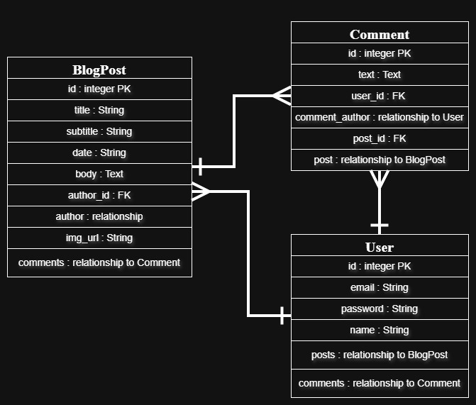

# Personal Blog 🌶️📝✍️

This is a project which outputted from **[elasti_py/ Day071](https://github.com/erfaw/elasti_py/tree/master/Day071-erf)** repo.

| [Explain the path till here...](https://github.com/erfaw/elasti_py-Day071-erf-Deploy-Blog-Site#explain-the-path-till-here) 
| [Overview](https://github.com/erfaw/elasti_py-Day071-erf-Deploy-Blog-Site#overview) 
| [How to Run](https://github.com/erfaw/elasti_py-Day071-erf-Deploy-Blog-Site#-how-to-run) 
| [ER-Diagram](https://github.com/erfaw/elasti_py-Day071-erf-Deploy-Blog-Site#er-diagram) 
| [What I Learned](https://github.com/erfaw/elasti_py-Day071-erf-Deploy-Blog-Site#-what-i-learned) 
|


---
---
---
<br>
<br>
<br>
<br>

## Explain the path till here...
This project made at **[elasti_py/ Day057/ 3. Capstone Project](https://github.com/erfaw/elasti_py/tree/master/Day057-erf/3.%20Capstone%20Project)** for first time and improved many times in **[elasti_py/ Day059/ Upgraded Blog](https://github.com/erfaw/elasti_py/tree/master/Day059-erf/Upgraded%20Blog)** && **[elasti_py/ Day060/ 2. blog with contact form](https://github.com/erfaw/elasti_py/tree/master/Day060-erf/2.%20blog%20with%20contact%20form)** && **[elasti_py/ Day067/ Upgraded Upgraded Blog Site](https://github.com/erfaw/elasti_py/tree/master/Day067-erf/Upgraded%20Upgraded%20Blog%20Site)** with what we learned about `Flask` framework in general to learn through the Udemy course [`Udemy – 100-days-of-code: Python - Angela Yu`](https://www.udemy.com/course/100-days-of-code/).


## Overview
This project is a **personal blog web application** built with `Flask` and its related extensions.
Users can **create accounts**, **log in securely**, **publish blog posts**, **leave comments**, and interact with content shared by other users.
The application focuses on user authentication, content management, database integration, and building dynamic web experiences using Flask.

### Key Technologies Used:

### ER-Diagram


## 🚀 How to Run
1. Ensure you have Python installed.

2. Clone the repository: 
    ```
    git clone https://github.com/erfaw/elasti_py-Day071-erf-Deploy-Blog-Site
    ```

3. Make Virtual Environment: 
    ```
    python -m venv .venv
    ```

    then on Git Bash: 
    ```
    source ./.venv/Scripts/activate
    ```

4. Install dependencies: 
    ```
    pip install requirements.txt
    ```

5. Make `.env` for `SECRET_KEY`:
    ```
    touch .env
    ```
    then inside it make a key-value pare like this: 
    ```
    SECRET_KEY="PUT_YOUR_KEY_HERE"
    ```
    then **fill it with a STRONG one!**

6. Run local (`DEBUG = True`): 
    ```
    python main.py
    ```

## 💡 What I Learned

